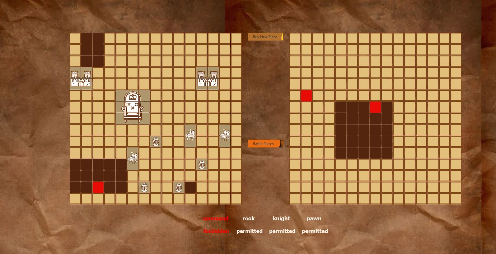

# Battle of Empires

Battle of Empires is the mid-term project for an advanced programming course focusing on Object-Oriented Programming (
OOP) and Java at Ferdowsi University of Mashhad.

### Overview

Battle of Empires is a unique board game that blends elements of chess with the classic Battleship game. In this
intriguing fusion, chess pieces serve as your military units on the battlefield.

